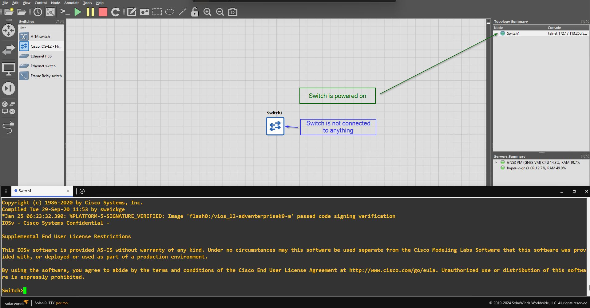
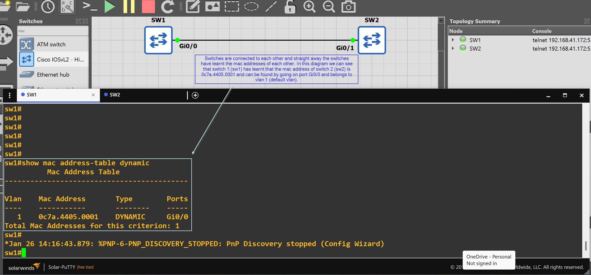
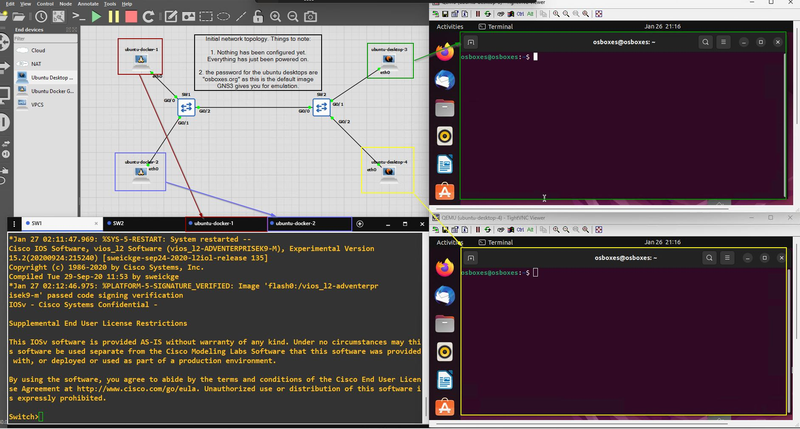
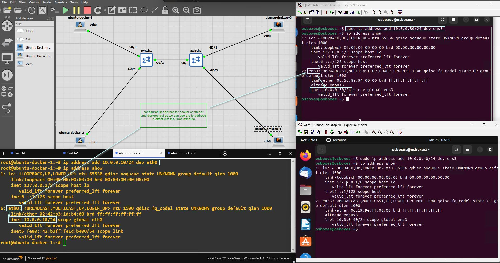

# CCNA-layer2-labs

## Introduction

This is a repository where I display the layer 2 labs I've implemented with GNS3 using cisco images. The focus of these labs is to document the process in achieving different outcomes (for example, a simple outcome could just be to set a password on a Cisco switch). The commands are also demonstrated in each lab exercise as is the network topology on GNS3 (when necessary).

## Lab 1: Manage hostname and secret to get into enable/privileged EXEC mode

The GNS3 network topology is shown below:



To create a hostname and secret to get into enable mode, we must define the hostname, the secret and save that configuration to the startup-config file:

```
Switch>enable
Switch#configure terminal
Switch(config)#hostname mason
mason(config)#enable secret faith
mason(config)#exit
mason#write ! or write memory or copy running-config startup-config
mason#exit
```

Shut down the cisco device and then start it up again. Note that now you will have to enter in the password `faith` to get into enable mode. When typing in the password, it will be masked to the user:

```
mason>enable
Password:
mason#
```

Delete the startup-config and restart the switch. This will bring you back to the default switch screen.

```
mason#write erase ! OR erase startup-config
mason#reload ! Press enter on the prompt
```

Note: that you can also show the running-conig and startup-config from priviliged EXEC mode / enable mode:

```
Switch>enable
Switch#show startup-config
Switch#show running-config
```

## Lab 2: MAC address learning - Connecting between two switches

**Purpose**: In the following lab we will be seeing how to configure switches to communicate with one another and learn each other's MAC addresses.

**Note**: vlans are mentioned here in the commands but they will be explored more in depth in future labs. It just suffices to know that by default the switch and all things attached to it are part of vlan 1.

We can see that by default, that when you connect 2 switches the MAC address table of the switches contain the MAC address of each other. Take the following GNS3 network topology as an example:



We can see that for switch 1 (sw1), it automatically holds the mac address of switch 2 (sw2) when connected and turned on:

```
sw1#show mac address-table dynamic
          Mac Address Table
-------------------------------------------

Vlan    Mac Address       Type        Ports
----    -----------       --------    -----
   1    0c7a.4405.0001    DYNAMIC     Gi0/0
Total Mac Addresses for this criterion: 1
```

Similarly, we can see for switch 2 (sw2), it automatically holds the mac address of switch 1 (sw1) when connected and turned on:

```
sw2#show mac address-table dynamic
          Mac Address Table
-------------------------------------------

Vlan    Mac Address       Type        Ports
----    -----------       --------    -----
   1    0c04.471d.0000    DYNAMIC     Gi0/1
```

To configure an ip address on a switch, we must:

1. Go into interface configuration mode for the default vlan (vlan 1. We do this for simplicity as of right now, but in future we can use other vlans too)
2. Assign an ip address and
3. Ensure that the vlan is not shutdown.

We will assign the ip address `10.0.0.1` with a subnet mask of `/24 = 255.255.255.0` to `sw1` and we will assign the ip address `10.0.0.2` with a subnet mask of `/24 = 255.255.255.0` to `sw2`. Afterwards we also clear the mac address table of each switch to ensure that we have a blank slate.

For `sw1` we can do that with the following commands:

```
sw1#configure terminal
sw1(config)#interface vlan 1
sw1(config-if)#ip address 10.0.0.1 255.255.255.0
sw1(config-if)#no shutdown
sw1(config-if)#exit
sw1(config)#exit
sw1#clear mac address-table dynamic
```

For `sw2` do the exact same commands except change `10.0.0.1` $\rightarrow$ `10.0.0.2`.

```
sw2#configure terminal
sw2(config)#interface vlan 1
sw2(config-if)#ip address
sw2(config-if)#ip address 10.0.0.2 255.255.255.0
sw2(config-if)#no shutdown
sw2(config-if)#exit
sw2(config)#exit
sw2(config)#exit
sw2#clear mac address-table dynamic
```

Now if we `ping` `sw2` from `sw1` with `ping 10.0.0.2` and then observe the mac address tables again we see the following (newlines put in to help readability) for `sw1`:

```
sw1#ping 10.0.0.2

Type escape sequence to abort.
Sending 5, 100-byte ICMP Echos to 10.0.0.2, timeout is 2 seconds:
.!!!!
Success rate is 80 percent (4/5), round-trip min/avg/max = 6/9/13 ms

sw1#show mac address-table dynamic
          Mac Address Table
-------------------------------------------

Vlan    Mac Address       Type        Ports
----    -----------       --------    -----
   1    0c7a.4405.0001    DYNAMIC     Gi0/0
   1    0c7a.4405.8001    DYNAMIC     Gi0/0
Total Mac Addresses for this criterion: 2

```

And we see the following for `sw2`:

```
sw2#show mac address-table dynamic
          Mac Address Table
-------------------------------------------

Vlan    Mac Address       Type        Ports
----    -----------       --------    -----
   1    0c04.471d.0000    DYNAMIC     Gi0/1
   1    0c04.471d.8001    DYNAMIC     Gi0/1
Total Mac Addresses for this criterion: 2

```

**Explanation**: When we sent a ping request to the ip address of `sw2` (10.0.0.2) from `sw1`, an `ARP` request was made to `sw2` from `sw1`. Hence there is 1 missing request which didn't go through. Afterwards, as the ping request (probably request 2 out of 5) goes from `sw1` to `sw2`, `sw2` is able to learn the new virtual MAC address `0c04.471d.8001` for `sw1` on vlan 1. Next as the ping reply goes back to `sw1`, the source and destination MAC addresses are now changed and hence, `sw1` is able to learn the new MAC address `0c7a.4405.8001` for `sw2` on vlan1. Hence with ARP, the IP address is transformed into a MAC address and the ping requests (specifically the source MAC address) allow for the updating of the MAC address tables in each switch.

## Lab 3: MAC address learning - End hosts

**Purpose**: In the following lab we will be seeing how the MAC address table of each switch gets updated.

### Step 1: Configure switches

We will clear the existing configuration of the switches and set a simple hostname for each one. We will also clear the existing mac address table in case there are dynamic entries in it.

For `Switch1`:

```
Switch>enable
Switch#erase startup-config
Switch#configure terminal
Switch(config)#hostname sw1
sw1(config)#do copy running-config startup-config
sw1(config)#exit
sw1#reload
sw1>enable
sw1#clear mac address-table dynamic
```

For `Switch2`, repeat the identical commands with the only change of changing the hostname `sw1` to `sw2`.

The following GNS3 network topology shows what we have configured so far:



### Step 2: Configure IP address ranges for the end hosts

> **Note: (⚠️)** Though we are focusing on **layer 2** specifically, we will be using **layer 3** addressing (with ip addresses) to be able to communicate between the endpoints. The crucial detail here is that `ARP` will be the layer 2 protocol which will resolve these ip addresses to the MAC addresses (thus serving the crucial bridge between the layer 2 and not yet talked about layer 3 concepts). To find out more refer to this helpful video by Jeremy's IT lab [here](https://www.youtube.com/watch?v=5q1pqdmdPjo&list=PLxbwE86jKRgMpuZuLBivzlM8s2Dk5lXBQ&index=11).

We will configure the following ip addresses:

- `10.0.0.10` $\rightarrow$ `ubuntu-docker-1`
- `10.0.0.20` $\rightarrow$ `ubuntu-docker-2`
- `10.0.0.30` $\rightarrow$ `ubuntu-desktop-3`
- `10.0.0.40` $\rightarrow$ `ubuntu-desktop-4`

To do that, you can firstly obtain the interface names throught the following command:

```
ip address show | grep -E '^[0-9]*:' | awk '{print $2}' | sed 's/://g'
```

and ignore the loopback interface `lo`. The other interface name (there should only be `lo` and `eth0` or `ens3`) should be the name of the interface.

We then use this name to configure the ip address for the end hosts. For example, with `ubuntu-docker-1`, to configure the ip address enter in the commands:

```bash
ip_address="10.0.0.10/24"
device_interface_name="eth0"
ip address add "${ip_address}" dev "${device_interface_name}"
```

Change the **ip_address** and **device_interface_name** appropriately depending on what the ip address and device interface name should be for `ubuntu-docker-2`, `ubuntu-desktop-3` and `ubuntu-desktop-4`. The ubuntu desktops will need `sudo` privileges and the password is `osboxes.org`.


