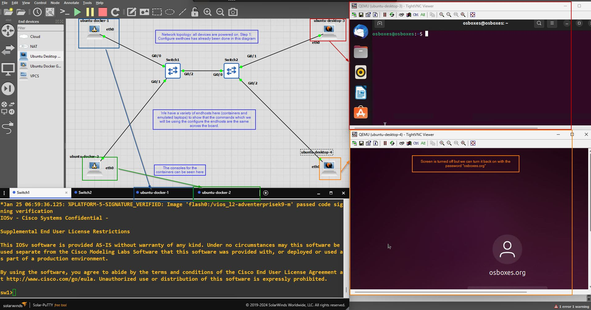

# CCNA-layer2-labs

## Introduction

This is a repository where I display the layer 2 labs I've implemented with GNS3 using cisco images. The focus of these labs is to document the process in achieving different outcomes (for example, a simple outcome could just be to set a password on a Cisco switch). The commands are also demonstrated in each lab exercise as is the network topology on GNS3 (when necessary).

## Lab 1: Manage hostname and secret to get into enable/privileged EXEC mode

The GNS3 network topology is shown below:


To create a hostname and secret to get into enable mode, we must define the hostname, the secret and save that configuration to the startup-config file:

```
Switch>enable
Switch#configure terminal
Switch(config)#hostname mason
mason(config)#enable secret faith
mason(config)#exit
mason#write ! or write memory or copy running-config startup-config
mason#exit
```

Shut down the cisco device and then start it up again. Note that now you will have to enter in the password `faith` to get into enable mode. When typing in the password, it will be masked to the user:

```
mason>enable
Password:
mason#
```

Delete the startup-config and restart the switch. This will bring you back to the default switch screen.

```
mason#write erase ! OR erase startup-config
mason#reload ! Press enter on the prompt
```

Note: that you can also show the running-conig and startup-config from priviliged EXEC mode / enable mode:

```
Switch>enable
Switch#show startup-config
Switch#show running-config
```

## Lab 2: MAC address learning

Purpose: In the following lab we will be seeing how the MAC address table of each switch gets updated.

### Step 1: Configure switches

We will clear the existing configuration of the switches and set a simple hostname for each one. We will also clear the existing mac address table in case there are dynamic entries in it.

For `Switch1`:

```
Switch>enable
Switch#erase startup-config
Switch#configure terminal
Switch(config)#hostname sw1
sw1(config)#do copy running-config startup-config
sw1(config)#exit
sw1#reload
sw1>enable
sw1#clear mac address-table dynamic
```

For `Switch2`, repeat the identical commands with the only change of changing the hostname `sw1` to `sw2`.

The following GNS3 network topology shows what we have configured so far:


