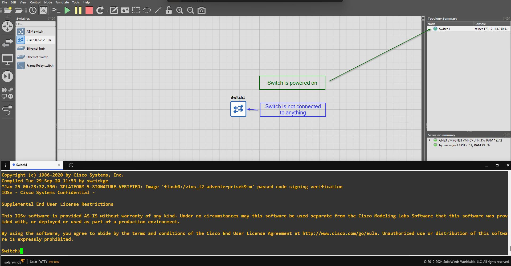
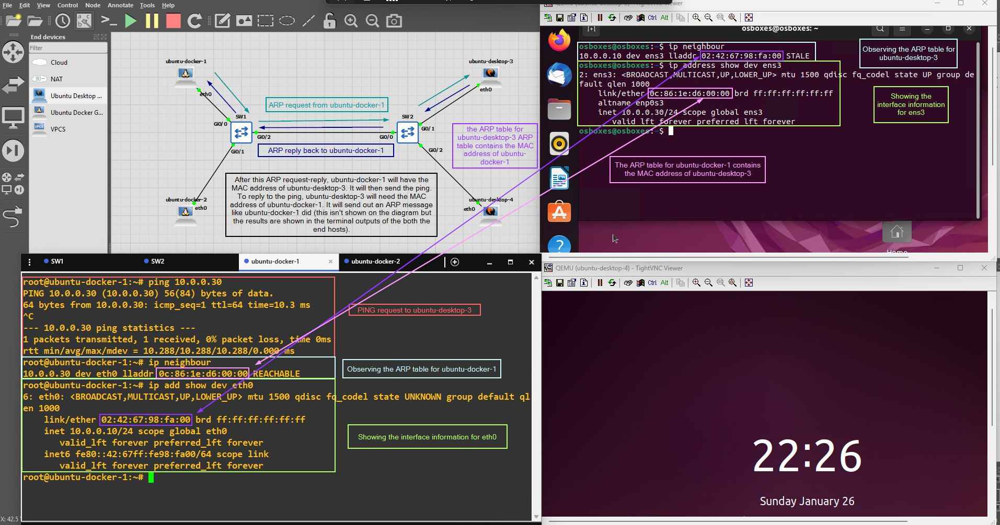
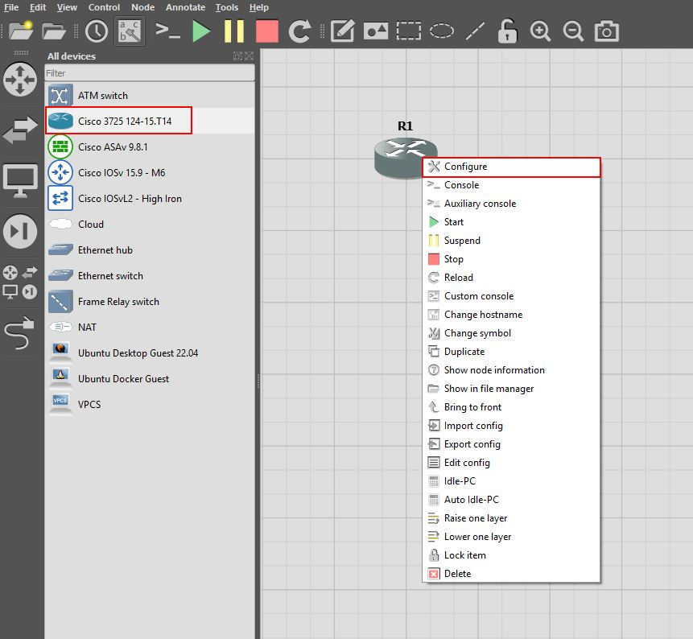
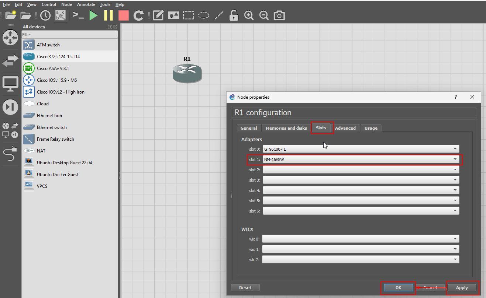
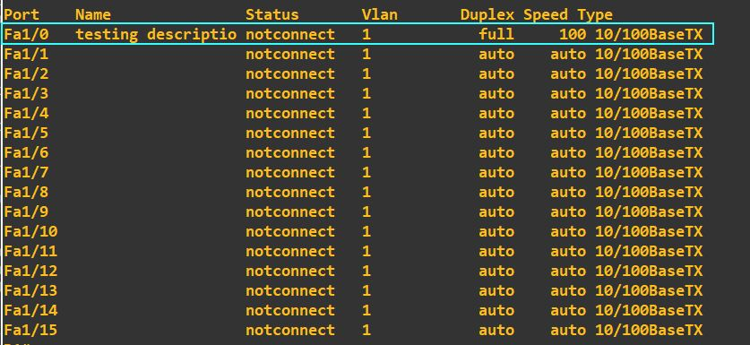
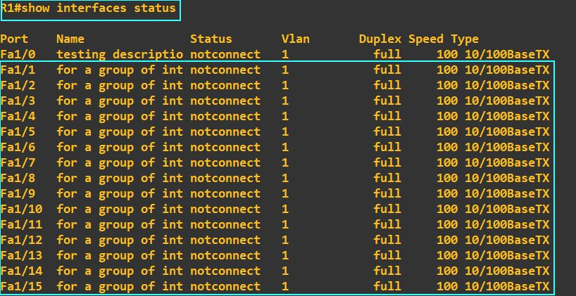
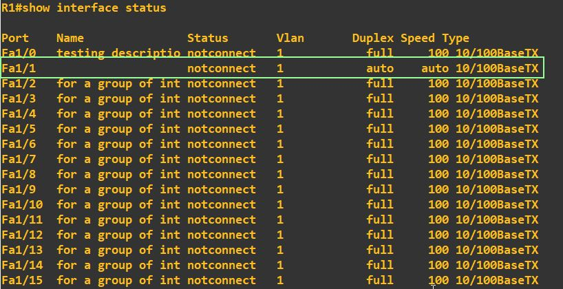
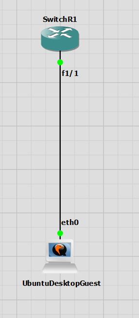
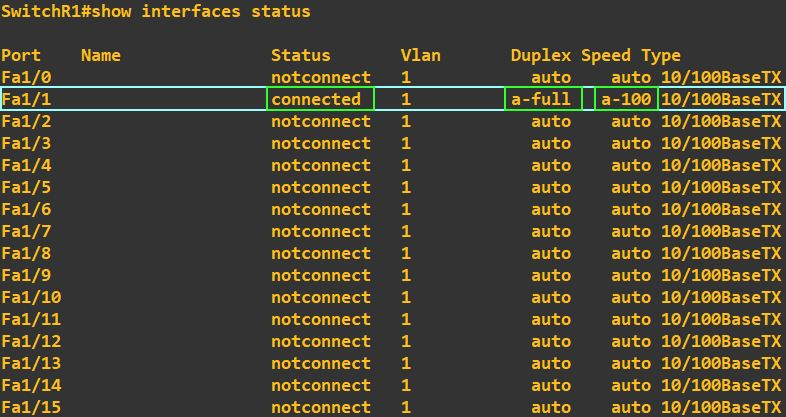

# CCNA-layer2-labs

## Introduction

This is a repository where I display the layer 2 labs I've implemented with GNS3 using cisco images. The focus of these labs is to document the process in achieving different outcomes (for example, a simple outcome could just be to set a password on a Cisco switch). The commands are also demonstrated in each lab exercise as is the network topology on GNS3 (when necessary).

## Lab 1: Manage hostname and secret to get into enable/privileged EXEC mode and enable helpful features to avoid lab frustrations

The GNS3 network topology is shown below:



To create a hostname and secret to get into enable mode, we must define the hostname, the secret and save that configuration to the startup-config file:

```
Switch>enable
Switch#configure terminal
Switch(config)#hostname mason
mason(config)#enable secret faith
mason(config)#exit
mason#write ! or write memory or copy running-config startup-config
mason#exit
```

Shut down the cisco device and then start it up again. Note that now you will have to enter in the password `faith` to get into enable mode. When typing in the password, it will be masked to the user:

```
mason>enable
Password:
mason#
```

Delete the startup-config and restart the switch. This will bring you back to the default switch screen.

```
mason#write erase ! OR erase startup-config
mason#reload ! Press enter on the prompt
```

Note: that you can also show the running-conig and startup-config from priviliged EXEC mode / enable mode:

```
Switch>enable
Switch#show startup-config
Switch#show running-config
```

Finally: Here are some helpful configurations to remember to help avoid frustrations

```
Switch#configure terminal
Switch(config)#no ip domain-lookup
Switch(config)#line console 0
Switch(config-line)#exec-timeout 0 0
Switch(config-line)#logging synchronous
Switch(config-line)#history size 20
Switch(config-line)#exit
Switch(config)#exit
Switch#
```

An explantion of each command is as follows:

- `no ip domain-lookup`: console will block by doing a dns lookup for mis-typed commands. disable this
- `exec-timeout 0 0`: set inactivity timer to never
- `logging synchronous`: only allow annoying output messages to come after show commands and not when you're in the middle of typing a command
- `history size 20`: history is limited to 20 commands

## Lab 2: MAC address learning - Connecting between two switches

**Purpose**: In the following lab we will be seeing how to configure switches to communicate with one another and learn each other's MAC addresses.

> **Note: (⚠️)** vlans are mentioned here in the commands but they will be explored more in depth in future labs. It just suffices to know that by default the switch and all things attached to it are part of vlan 1..

> **Note: (⚠️)** Though we are focusing on **layer 2** specifically, we will be using **layer 3** addressing (with ip addresses) to be able to communicate between the endpoints. The crucial detail here is that `ARP` will be the layer 2 protocol which will resolve these ip addresses to the MAC addresses (thus serving the crucial bridge between the layer 2 and not yet talked about layer 3 concepts). To find out more refer to this helpful video by Jeremy's IT lab [here](https://www.youtube.com/watch?v=5q1pqdmdPjo&list=PLxbwE86jKRgMpuZuLBivzlM8s2Dk5lXBQ&index=11).

We can see that by default, that when you connect 2 switches the MAC address table of the switches contain the MAC address of each other. Take the following GNS3 network topology as an example:


We can see that for switch 1 (sw1), it automatically holds the mac address of switch 2 (sw2) when connected and turned on:

```
sw1#show mac address-table dynamic
          Mac Address Table
-------------------------------------------

Vlan    Mac Address       Type        Ports
----    -----------       --------    -----
   1    0c7a.4405.0001    DYNAMIC     Gi0/0
Total Mac Addresses for this criterion: 1
```

Similarly, we can see for switch 2 (sw2), it automatically holds the mac address of switch 1 (sw1) when connected and turned on:

```
sw2#show mac address-table dynamic
          Mac Address Table
-------------------------------------------

Vlan    Mac Address       Type        Ports
----    -----------       --------    -----
   1    0c04.471d.0000    DYNAMIC     Gi0/1
```

To configure an ip address on a switch, we must:

1. Go into interface configuration mode for the default vlan (vlan 1. We do this for simplicity as of right now, but in future we can use other vlans too)
2. Assign an ip address and
3. Ensure that the vlan is not shutdown.

We will assign the ip address `10.0.0.1` with a subnet mask of `/24 = 255.255.255.0` to `sw1` and we will assign the ip address `10.0.0.2` with a subnet mask of `/24 = 255.255.255.0` to `sw2`. Afterwards we also clear the mac address table of each switch to ensure that we have a blank slate.

For `sw1` we can do that with the following commands:

```
sw1#configure terminal
sw1(config)#interface vlan 1
sw1(config-if)#ip address 10.0.0.1 255.255.255.0
sw1(config-if)#no shutdown
sw1(config-if)#exit
sw1(config)#exit
sw1#clear mac address-table dynamic
```

For `sw2` do the exact same commands except change `10.0.0.1` $\rightarrow$ `10.0.0.2`.

```
sw2#configure terminal
sw2(config)#interface vlan 1
sw2(config-if)#ip address
sw2(config-if)#ip address 10.0.0.2 255.255.255.0
sw2(config-if)#no shutdown
sw2(config-if)#exit
sw2(config)#exit
sw2#clear mac address-table dynamic
```

Now if we `ping` `sw2` from `sw1` with `ping 10.0.0.2` and then observe the mac address tables again we see the following (newlines put in to help readability) for `sw1`:

```
sw1#ping 10.0.0.2

Type escape sequence to abort.
Sending 5, 100-byte ICMP Echos to 10.0.0.2, timeout is 2 seconds:
.!!!!
Success rate is 80 percent (4/5), round-trip min/avg/max = 6/9/13 ms

sw1#show mac address-table dynamic
          Mac Address Table
-------------------------------------------

Vlan    Mac Address       Type        Ports
----    -----------       --------    -----
   1    0c7a.4405.0001    DYNAMIC     Gi0/0
   1    0c7a.4405.8001    DYNAMIC     Gi0/0
Total Mac Addresses for this criterion: 2

```

And we see the following for `sw2`:

```
sw2#show mac address-table dynamic
          Mac Address Table
-------------------------------------------

Vlan    Mac Address       Type        Ports
----    -----------       --------    -----
   1    0c04.471d.0000    DYNAMIC     Gi0/1
   1    0c04.471d.8001    DYNAMIC     Gi0/1
Total Mac Addresses for this criterion: 2

```

**Explanation**: When we sent a ping request to the ip address of `sw2` (10.0.0.2) from `sw1`, an `ARP` request was made to `sw2` from `sw1`. Hence there is 1 missing request which didn't go through. Afterwards, as the ping request (probably request 2 out of 5) goes from `sw1` to `sw2`, `sw2` is able to learn the new virtual MAC address `0c04.471d.8001` for `sw1` on vlan 1. Next as the ping reply goes back to `sw1`, the source and destination MAC addresses are now changed and hence, `sw1` is able to learn the new MAC address `0c7a.4405.8001` for `sw2` on vlan1. Hence with ARP, the IP address is transformed into a MAC address and the ping requests (specifically the source MAC address) allow for the updating of the MAC address tables in each switch.

## Lab 3: MAC address learning and ARP table - End hosts

> **Note: (⚠️)** We will be using `ARP` again to resolve layer 3 ip addresses to layer 2 MAC addresses. This will be a common theme in a lot of the labs.

**Purpose**: In the following lab we will be seeing how the MAC address table of each switch gets updated and how the ARP table for the endhosts get updated.

The following diagram outlines the initial topology we have set up:


### Step 1: Configure hostnames for the switches and show initial MAC address tables

We will clear the existing configuration of the switches and set a simple hostname for each one. We will also clear the existing mac address table in case there are dynamic entries in it.

For `Switch 1` (`Switch 2` configuration is identical and is made in a comment):

```
Switch>enable
Switch#erase startup-config
Switch#configure terminal
Switch(config)#hostname sw1 ! hostname sw2 for switch 2
sw1(config)#do copy running-config startup-config
sw1(config)#exit
sw1#reload
sw1>enable
sw1#clear mac address-table dynamic
sw1#show mac address-table dynamic
```

The MAC address table for `sw1` is:

```
sw1#show mac address-table dynamic
          Mac Address Table
-------------------------------------------

Vlan    Mac Address       Type        Ports
----    -----------       --------    -----
   1    0c19.772d.0000    DYNAMIC     Gi0/2
Total Mac Addresses for this criterion: 1

! Inserted comment: The MAC address 0c19.772d.0000 belongs to sw2.
```

The MAC address table for `sw2` is:

```
sw2#show mac address-table dynamic
          Mac Address Table
-------------------------------------------

Vlan    Mac Address       Type        Ports
----    -----------       --------    -----
   1    0c4c.b477.0002    DYNAMIC     Gi0/0
Total Mac Addresses for this criterion: 1

! Inserted comment: The MAC address 0c4c.b477.0002 belongs to sw1.
```

### Step 2: Configure IP address ranges for the end hosts

We will configure the following ip addresses:

- `10.0.0.10` $\rightarrow$ `ubuntu-docker-1`
- `10.0.0.20` $\rightarrow$ `ubuntu-docker-2`
- `10.0.0.30` $\rightarrow$ `ubuntu-desktop-3`
- `10.0.0.40` $\rightarrow$ `ubuntu-desktop-4`

To do that, you can firstly obtain the interface names throught the following command:

```
ip address show | grep -E '^[0-9]*:' | awk '{print $2}' | sed 's/://g'
```

and ignore the loopback interface `lo`. Generally what I've found is that the interface is called `eth0` for the docker containers and `ens3` for the ubuntu emulated desktops.

We then use this name to configure the ip address for the end hosts. For example, with `ubuntu-docker-1`, to configure the ip address enter the command:

```bash
ip address add "10.0.0.10/24" dev "eth0"
```

For the emulated ubuntu desktops (for example `ubuntu-desktop-3`), to configure the ip address enter the command:

```bash
sudo ip address add "10.0.0.30/24" dev "ens3"
```

where the password is `osboxes.org` to gain access to root privileges.

### Step 3: ARP table and MAC address table for communication between end host 1 and end host 3

To begin, ensure that you enter the command `clear mac address-table dynamic` into both `sw1` and `sw2` as if you've left them for some time they may have (usually very helpfully, but not in this case) populated their MAC address tables with the MAC addresses of the end hosts on their LAN.

We now send a message from `ubuntu-docker-1` to `ubuntu-desktop-3` with `ping 10.0.0.30`. What this will do is the following:

1. Update the MAC address table of `sw1` with the MAC address of `ubuntu-docker-1` due to the ARP request sent from host 1. This is a broadcast message.
1. Update the MAC address table of `sw2` with the MAC address of `ubuntu-docker-1` due to the ARP request sent from host 1. This is a broadcast message.
1. Update the MAC address table of `sw2` with the MAC address of `ubuntu-desktop-3` due to the ARP reply sent from host 3. This is a unicast message.
1. Update the MAC address table of `sw1` with the MAC address of `ubuntu-desktop-3` due to the ARP reply sent from host 3. This is a unicast message.
1. Update the ARP table of `ubuntu-docker-1` with the MAC address of `ubuntu-desktop-3` when it receives back an ARP reply.
1. Next `ubuntu-docker-1` will be able to form the ping request to `ubuntu-desktop-3` and send it.
1. When `ubuntu-desktop-3` has to reply, it will have to go through steps (1) --> (6) as if it were doing `ping 10.0.0.10` as it now needs to know the MAC address of `ubuntu-docker-1`.

The diagram below illustrates the process and results on the two end hosts:



The MAC address tables for the two switches are shown below:

For `sw1`:

```
sw1#show mac address-table dynamic
          Mac Address Table
-------------------------------------------

Vlan    Mac Address       Type        Ports
----    -----------       --------    -----
   1    0242.6798.fa00    DYNAMIC     Gi0/0
   1    0c19.772d.0000    DYNAMIC     Gi0/2
   1    0c86.1ed6.0000    DYNAMIC     Gi0/2
Total Mac Addresses for this criterion: 3

```

For `sw2`:

```
sw2#show mac address-table dynamic
          Mac Address Table
-------------------------------------------

Vlan    Mac Address       Type        Ports
----    -----------       --------    -----
   1    0242.6798.fa00    DYNAMIC     Gi0/0
   1    0c4c.b477.0002    DYNAMIC     Gi0/0
   1    0c86.1ed6.0000    DYNAMIC     Gi0/1
Total Mac Addresses for this criterion: 3
```

Note how the MAC addresses for host 1 (`0242.6798.fa00`) and host 3 (`0c86.1ed6.0000`) show up in the MAC address table.

### Step 4: ARP table and MAC address table for communication between end host 2 and end host 4

Similarly if we enter the command `ping 10.0.0.40` from `ubuntu-docker-2` to reach `ubuntu-desktop-4` we get the following results:

For `sw1` the MAC address table is:

```
sw1#show mac address-table
          Mac Address Table
-------------------------------------------

Vlan    Mac Address       Type        Ports
----    -----------       --------    -----
   1    0242.6798.fa00    DYNAMIC     Gi0/0
   1    0242.8b44.ea00    DYNAMIC     Gi0/1
   1    0c19.772d.0000    DYNAMIC     Gi0/2
   1    0c3c.5436.0000    DYNAMIC     Gi0/2
   1    0c86.1ed6.0000    DYNAMIC     Gi0/2
Total Mac Addresses for this criterion: 5
```

For `sw2` the MAC address table is:

```
sw2#show mac address-table
          Mac Address Table
-------------------------------------------

Vlan    Mac Address       Type        Ports
----    -----------       --------    -----
   1    0242.6798.fa00    DYNAMIC     Gi0/0
   1    0242.8b44.ea00    DYNAMIC     Gi0/0
   1    0c3c.5436.0000    DYNAMIC     Gi0/2
   1    0c4c.b477.0002    DYNAMIC     Gi0/0
   1    0c86.1ed6.0000    DYNAMIC     Gi0/1
Total Mac Addresses for this criterion: 5

```

- For `ubuntu-docker-2`:
  - `ip neighbour` shows us `10.0.0.40 dev eth0 lladdr 0c:3c:54:36:00:00 REACHABLE`
  - `ip address show dev eth0` shows us the MAC address is `02:42:8b:44:ea:00`
- For `ubuntu-desktop-4`:
  - `ip neighbour` shows us `10.0.0.20 dev ens3 lladdr 02:42:8b:44:ea:00 REACHABLE`
  - `ip address show dev eth0` shows us the MAC address is `0c:3c:54:36:00:00`

### Step 5: Update the ARP table for host 1 then delete it

From `ubunut-docker-1`:

1. type in `ping 10.0.0.20` and `ping 10.0.0.40`.
1. Next check the arp table with `ip neighbour`
   ```
   root@ubuntu-docker-1:~# ip neighbour
   10.0.0.20 dev eth0 lladdr 02:42:8b:44:ea:00 DELAY
   10.0.0.30 dev eth0 lladdr 0c:86:1e:d6:00:00 REACHABLE
   10.0.0.40 dev eth0 lladdr 0c:3c:54:36:00:00 STALE
   ```
1. Delete the ARP table for the subnet `10.0.0.0/24`
   ```
   root@ubuntu-docker-1:~# ip neighbour flush to 10.0.0.0/24
   root@ubuntu-docker-1:~# ip neighbour
   root@ubuntu-docker-1:~# # See there is no output in the table.
   ```

## Lab 4: Configure simple passwords and local username/secrets for accessing the console

**Purpose**: To show how to configure:

1. A simple password to enable console access
1. A local username and secret to enable console access

### Configure simple password to enable console access

```
Switch#configure terminal
Switch(config)#line console 0
Switch(config-line)#password faith
Switch(config-line)#login
Switch(config-line)#exit
Switch(config)#exit
Switch#exit
```

Upon exiting and entering the console again, you will have to enter the password `faith`.

To disable the need for a password, enter in the following commands:

```
Switch#configure terminal
Switch(config)#line console 0
Switch(config-line)#no login
Switch(config-line)#exit
Switch(config)#exit
Switch#exit
```

### Configure a local username / secret to access console

To configure a local username / secret to access the console (e.g **username**: `mason` and **secret**: `dogs` and **username**: `mathew` and **secret**: `cats`)

```
Switch>enable
Switch#configure terminal
Switch(config)#username mason secret dogs
Switch(config)#username mathew secret cats
Switch(config)#line console 0
Switch(config-line)#no password ! OPTIONAL
Switch(config-line)#login local
Switch(config-line)#exit
Switch(config)#exit
Switch#exit
```

Like before, to disable the need for any username / secret combination use the `Switch(config-line)#no login` command.

## Lab 5: Configure access to the switch with telnet

### Step 1: Configure an IP Address for the switch

```
Switch>enable
Switch#configure terminal
Switch(config)#interface vlan 1
Switch(config-if)#ip address 10.0.0.1 255.255.255.0
Switch(config-if)#no shutdown
Switch(config-if)#exit
Switch(config)#exit
```

### Step 2: Configure an IP Address for the host

```
root@Docker:~# ip address add 10.0.0.2/24 dev eth0
```

### Step 3: Configure a password to get into Privileged EXEC / Enable mode

```
Switch>enable secret faith
```

### Step 4: Enable a local username and secret to log into the vty line

```
Switch(config)#username mason secret wong
Switch(config)#line vty 0 15
Switch(config-line)#login local
Switch(config-line)#no password
Switch(config-line)#exit
Switch(config)#exit
```

### Step 5: Enable telnet on the virtual terminal line

```
Switch(config)#line vty 0 15
Switch(config-line)#transport input telnet
Switch(config)#exit
```

### Step 6: Log into the switch with telnet

```
root@Docker:~#telnet 10.0.0.1
Username:mason
Password:wong # normally masked
Switch>enable
Password:faith # normally masked
```

Of course you can also swap out step 4 which uses a local username and secret to just a global password for the switch.

## Lab 6: Configure access to the switch with ssh

Accessing the switch with SSH is very similar to telnet except of two main steps

### Step 1: Configure an IP Address for the switch

```
Switch>enable
Switch#configure terminal
Switch(config)#interface vlan 1
Switch(config-if)#ip address 10.0.0.1 255.255.255.0
Switch(config-if)#no shutdown
Switch(config-if)#exit
Switch(config)#exit
```

### Step 2: Configure an IP Address for the host

```
root@Docker:~# ip address add 10.0.0.2/24 dev eth0
```

### Step 3: Configure a password to get into Privileged EXEC / Enable mode

```
Switch>enable secret faith
```

### Step 4: Enable a local username and secret to log into the vty line

```
Switch(config)#username mason secret wong
Switch(config)#line vty 0 15
Switch(config-line)#login local
Switch(config-line)#no password
Switch(config-line)#exit
Switch(config)#exit
```

### Step 5: Enable ssh on the virtual terminal line

```
Switch(config)#line vty 0 15
Switch(config-line)#transport input ssh
Switch(config)#exit
```

### Step 6: Create the FQDN, generate keys for ssh on switch and use ssh version 2

```
Switch(config)#hostname sw1
sw1(config)#ip domain-name example.com
sw1(config)#crypto key generate rsa
How many bits in the modulus [512]: 1024
sw1(config)#ip ssh version 2
```

### Step 7: Find the host key algorithm being used on the switch

```
sw1#show ip ssh
```

Look for the line which says `Hostkey Algorithms`. In the lab environment I had two algorithms:

- `x509v3-ssh-rsa`
- `ssh-rsa`

### Step 8: Ensure connection with ssh uses the correct algorithms

The following command:

```
root@ubuntu1:~# ssh -o HostKeyAlgorithms=+ssh-rsa  mason@10.0.0.1
```

will most likely error with output similar to this:

> Unable to negotiate with 10.0.0.1 port 22: no matching key exchange method found. Their offer: diffie-hellman-group-exchange-sha1,diffie-hellman-group14-sha1,diffie-hellman-group1-sha1

Use one of the algorithms in the list in the error in the following command with the `KexAlgorithms` parameter. For example:

```
root@ubuntu1:~# ssh \
   -o HostKeyAlgorithms=+ssh-rsa \
   -o KexAlgorithms=+diffie-hellman-group14-sha1 \
   mason@10.0.0.1
```

- The **HostKeyAlgorithm** is the algorithm for the _host key_.
- The **KexAlgorithms** is the algorith for the _key exchange_.

And then finally check the connection with the `show ssh` command:

```
show ssh
```

which outputted for me something like the following:

```
sw1>show ssh
Connection Version Mode Encryption  Hmac         State                 Username
0          2.0     IN   aes128-ctr  hmac-sha1    Session started       mason
0          2.0     OUT  aes128-ctr  hmac-sha1    Session started       mason

```

### Miscellaneous commands

Things to ask yourself:

- How do I configure the switch to receive it's ip address via **DHCP** (that is, how do I make it a DHCP client?)
- How do I verify DHCP information on a switch? (`show dhcp lease`)
- How do I configure a **default gateway** for the switch?
- How do I configure **DNS** for the switch?
- What does the `show interfaces vlan 1` do?

## Lab 7: Enable speed, duplex and description for physical interface(s) and see results with `show interfaces status`
In the following example we use the `Cisco 3725` router with a configured switching module to grant it switching capabilities. The following diagram demonstrates this process by adding the `NM-16ESW` module to the router so that it obtains layer 2 switching features:






### Configure speed, duplex and description for one interface (fa1/0)
Configure **duplex**, **speed**, **description** and enable the interface with **no shutdown**
```
R1#configure terminal
R1(config)#interface FastEthernet 1/0
R1(config-if)#duplex full
R1(config-if)#speed 100
R1(config-if)#description Testing description for fa1/0
R1(config-if)#no shutdown
R1(config-if)#exit
R1(config)#exit
```
output the interface status with `show interfaces status`:
```
R1#show interfaces status
```
Which displays the following output:



### Configure speed, duplex and description for multiple interfaces
do the same thing for interfaces `Fa1/1-Fa1/15` with the `interface range fastEthernet 1/1 - 15` command:
```
R1#configure terminal
R1(config)#interface range fastEthernet 1/1 - 15
R1(config-if-range)#speed 100
R1(config-if-range)#duplex full
R1(config-if-range)#description for a group of interfaces
R1(config-if-range)#no shutdown
R1(config-if-range)#exit
R1(config)#exit
R1#show interfaces status
```



### Remove and default speed, duplex and description for one interface (fa1/1)
To default **speed**, **duplex** and **description** for `Fa1/1` we simply use the `no` command:
```
R1#configure terminal
R1(config)#interface fastEthernet 1/1
R1(config-if)#no speed
R1(config-if)#no duplex
R1(config-if)#no description
R1(config-if)#exit
R1(config)#exit
R1#show interfaces status
```



### See results of default autonegotiation when connecting a device
We create the following toplogy:



This removes all the configuration we did before. However the important part is the result of the `show interface status` command as we can see what is shown when autonegotiation has taken place:



* **Status**: connected => Both layer 1 and 2 are functioning.
* **Duplex**: a-full => duplex value of "full" was obtained via autonegotiation.
* **Speed**: 1-100 => duplex  value of "100" was obtained via autonegotiation.
